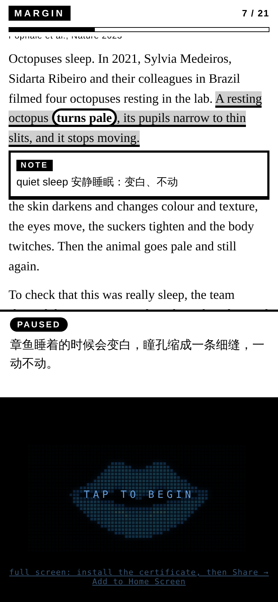

# Bibliothecary

**A personal librarian.** It prepares what you read at bedtime, reads it with you on an old Kindle or a phone, and files every question and answer in a reading report, so the next reading starts from what you already know.

*Bibliothecary* is an older English word for librarian, in use since the 1610s, from Latin *bibliothecarius*. In Chinese the project is simply 图书管理员.

[中文说明](README.zh-CN.md) · [Requirements](docs/requirements.md) · [Setup](docs/configuration.md) · [Known issues](docs/known-issues.md)

## Built from what a librarian does

We started from what a good librarian does, not from what AI can do, and mapped each duty to a feature.

| A librarian's duty | What Bibliothecary does |
|---|---|
| **Collection development**: deciding what to collect and from where | A collection with taste: a curated list of trusted sources for papers, news and long-form journalism, books and essays. Only classics, or work that is both new and good |
| **Reference interview**: finding out what the reader actually wants to know | Asks you once a day in the chat what you'd like to read tonight; learns your interests and goals the first time you use it |
| **Readers' advisory**: recommending for a particular person, mixing classics with new work | Selection rules: classics alternate with new work, hard alternates with easy, a monthly rhythm, never a paper every night |
| **Cataloguing**: every item recorded and findable | Each item is catalogued on entry: source, type, topic, difficulty, read or not, so nothing is suggested twice |
| **Circulation records** | Every evening's questions and answers are kept in full and written up as that day's reading report |
| **Reader instruction**: teaching people to read and understand | A structured session: background first, then the text, then review with questions |
| **Knowing the reader's level** | A knowledge map built from daytime chats and past reading reports: what you know, where the gaps are |
| **Confidentiality** | A real librarian never discloses what you borrowed, so everything stays on your own machine |

The job has changed over the centuries. The early *bibliothecary* — at Alexandria, in medieval monasteries, at the Bodleian in the 17th century — was above all a keeper: collecting, cataloguing, making sure no book was lost, sometimes chaining books to the shelves. In 1627 Gabriel Naudé advised collecting both the great old authors and the new ones. The modern librarian serves the reader: answering questions, recommending, teaching, and keeping what each person reads confidential. Bibliothecary takes from both: careful cataloguing and a collection chosen with taste, and service built around one person whose records stay private.

## What works today, and what comes next

Version 0.3 does the reading, the instruction, the records and the daily chat. The collection and the knowledge map are specified in the [requirements](docs/requirements.md) and come next.

| | |
|---|---|
| **Works now** | `biblio prepare` turns an article into a three-part session: background, reading, review questions. `biblio read` reads it on the Kindle and phone, takes spoken questions, waits for your answers to the review questions, and files a reading report when it ends. |
| **Also now** | `biblio telegram`: the librarian in a Telegram chat. Send it a link, a file or a voice message; it prepares the reading, asks you each day what you'd like to read tonight, and sends the reading report when you finish. |
| **Next** | v0.4 the collection (cataloguing, deduplication, default shelves) · v0.6 an MCP server for your own agent · v0.7 the knowledge map and spaced review |

## Three parts: use them together or on their own

| Part | What it is |
|---|---|
| **Bibliothecary** (`biblio`) | The librarian: prepares readings, keeps the records and writes the reading reports. |
| **Margin** (`margin`) | The reading room: a Kindle page with highlights, circled words, margin notes and small diagrams; a prepared talk you can interrupt; spoken questions answered by a model. |
| **Mouth** (`robot_lipsync`) | Turns speech timing into mouth shapes for Mandarin, English and Spanish, on a browser canvas or a 128×64 OLED (ESP32 firmware included). Optional. |

Any combination of devices works: phone only; Kindle and computer; Kindle and phone; phone and iPad; extra screens as extra mouths.

### With a phone only, or with a Kindle

The Kindle is optional. Everything is a web page served by your own computer, so a phone alone is enough: `/phone` shows the article above and the voice, microphone and mouth below.



| How you read | Open |
|---|---|
| Phone only | `https://<computer>:8765/phone` |
| Kindle + phone | Kindle: `http://<computer>:8765/` · phone: `https://<computer>:8765/speaker` |
| Phone + iPad | one opens `/` (the article), the other `/speaker` (voice and mouth) |

With `biblio telegram`, you don't type addresses: when a reading is ready, the chat shows a **📖 Read on this phone** button that opens it straight in the reading room, and the Kindle shows whatever is open. The reading room only serves your home Wi-Fi, from your own computer: everyone runs their own librarian, and nobody else can reach yours. (Microphone questions on the phone need the computer's certificate once; see [setup](docs/configuration.md#https-on-the-phone). Without it you can still listen and read.)

## Quick start

Python 3.11 or newer.

```bash
git clone https://github.com/Muurrphy/bibliothecary.git
cd bibliothecary
python3 -m venv .venv && source .venv/bin/activate
pip install -e .

# no keys, no cost: tonight's sample reading about how octopuses sleep
biblio read examples/octopus.lesson.json --voice silent --paused
```

Open the printed `http://<computer>:8765/` on the Kindle (Experimental Browser) and `http://localhost:8765/remote` on the computer to play, pause or type a question. When the session ends (or you press Ctrl+C), the reading report is filed:

```bash
biblio records          # every reading so far
biblio report --show    # the latest reading report
```

`bibliothecary` is the same command as `biblio`.

## Tonight's reading

```bash
cp .env.example .env      # add your OpenAI and ElevenLabs keys and a voice id
biblio prepare https://example.com/article --explain "Simplified Chinese" --bedtime
biblio read --voice elevenlabs --paused
```

`biblio read` without a name opens the oldest reading not finished yet. On the phone, open the printed `https://…:8765/speaker` address and tap the screen once. The phone needs the computer's local certificate for the microphone (steps in [setup](docs/configuration.md#https-on-the-phone)). In Safari, set **Website Settings → Microphone → Allow** for this address, or it asks again every time the page opens.

A session has three parts:

1. **Preview.** The background you need and may not have: terms, people, how something works. `biblio prepare --no-preview` leaves it out.
2. **Reading.** The talk goes through the article in order: what it is about, the main points, why it matters. Interrupt with a question at any time.
3. **Review.** A few questions (`biblio prepare --review N`, default 3). The librarian waits for your answer and tells you what you got right and what is missing. Say **继续 / go on** to skip one.

Short playback commands are handled directly: **继续 / go on**, **等一下 / wait**, **再说一遍 / say that again**, **跳过 / skip**, **从头讲 / start over**, **刷新 / refresh**. The device you tapped last is the one that listens; the others stay quiet mouths.

## The librarian in Telegram

If you have no personal agent of your own, the librarian can live in a Telegram chat.

1. In Telegram, open **@BotFather**, send `/newbot`, pick a name. It gives you a token.
2. Put it in `.env`: `TELEGRAM_BOT_TOKEN=...`
3. Run `biblio telegram --explain "Simplified Chinese"` and send your new bot the `/start` code it prints. From then on it answers only you.

Then, from anywhere:

- **Send a link, a .txt/.md/.html/.pdf file, or a voice message.** It prepares the reading and sends back the guide: the background and the main points.
- **Just talk.** "A classic paper on octopus sleep", "a good long read on black holes": it searches open-access papers (OpenAlex, arXiv; classic means well cited, new means the last year) or the collection's own shelves of sites (science writing and primary sources such as nobelprize.org, serious news, essays, full-text books; see `src/bibliothecary/shelves.toml`), suggests two or three with a reason each, and prepares the one you pick. Nothing from outside the collection gets through, and it only offers links it actually found. To change the collection, copy `shelves.toml` to `~/Bibliothecary/` and edit it. It knows what you have read and what was left unclear.
- **Every day** (`--ask-at 12:00`) it asks what you'd like to read tonight; in the evening (`--decide-at 19:00`) it tells you tonight's reading.
- **After the session**, the reading report arrives in the chat.
- `/tonight`, `/records`, `/report` do what they say; `/profile` shows what it remembers about you.

It talks like a librarian, not a search box: when you ask "what should I read tonight?" without saying much, it asks what has been on your mind and what the reading is for, then recommends with reasons that fit you. Every batch of search results is vetted by a second, strict pass, and only pieces that are really on topic and worth an evening reach the conversation; it would rather offer one good piece than three weak ones. What it learns about you is kept in `~/Bibliothecary/reader.json`.

Conversation and choosing need judgement, so they can use a stronger model than preparing does: set `BIBLIOTHECARY_CHAT_MODEL` in `.env` (or `--chat-model`). To try the librarian without Telegram, `biblio chat "what should I read tonight?"` talks in the terminal, shares the same memory, and prints every search with what was kept and why.

The computer has to be on for the bot to answer. Chat messages pass through Telegram's servers; the readings and records stay on your computer. Your chat with the librarian is kept locally in `~/Bibliothecary/chat.jsonl`.

## The reading report

Each reading has its own folder, all on your computer:

```text
~/Bibliothecary/readings/2026-10-08-how-octopuses-sleep/     ($BIBLIOTHECARY_HOME to move it)
  lesson.json      what is read aloud: preview, reading, review
  session.jsonl    every question and answer, verbatim, written the moment it is said
  summary.json     what a model made of the session (optional)
  report.md        the reading report
```

The report is written in two stages. `biblio prepare` writes the guide (background and notes) before you read; after the session it adds every question and answer word for word, your review answers next to a good answer, and, with a model, what still seems unclear and which threads are worth following. Summaries never replace the verbatim record. The report is in the language of the explanation. Plain Markdown with a YAML header: open it in any notes app, keep it in git, or let an agent read it.

## What each device does

| Device | Job |
|---|---|
| Kindle (tested on 10th generation, firmware 5.16) | Shows the article, the underline, the notes. Does not record anything. |
| Phone or iPad | Plays the voice, listens for your questions, shows the mouth. |
| Computer | Prepares readings, calls the models, keeps the records. |
| More phones or tablets (optional) | Extra mouths, all speaking at the same moment, without their own microphone. |

All devices need to be on the same Wi-Fi, and the computer has to be on while you read.

## How it works

```text
computer: reading + your question → answer → voice + character timing → records
   ├─ Kindle: article, underline, notes      (one long-poll page, plain ES5)
   └─ phone:  voice + mouth (robot_lipsync)  microphone → realtime model
```

- **The Kindle uses a lightweight page.** Plain JavaScript displays the article. Request timeouts, redraw handling and a watchdog help recover interrupted connections.
- **The model never draws on the screen directly.** It returns the same small steps a hand-written lesson uses, and every step is checked against the article.
- **Voice questions use a realtime model.** The phone streams audio through the computer to OpenAI. A stalled turn can fall back to transcription and a text model.
- **The answer is spoken sentence by sentence**, so the first sentence starts while the rest is still being voiced.
- **The mouth uses speech timestamps and the audio clock.** Local waveform checks correct phrase edges when pauses match clearly and close the mouth during detected silence. Phoneme timing within each character is still estimated; this is not phoneme-accurate forced alignment. See [mouth timing](docs/lipsync.md#timing-checks-in-the-reading-companion).
- **Nothing said is lost.** Each question and answer is appended to the reading's log as soon as it is spoken; the report is rebuilt from that log.

More: [requirements](docs/requirements.md), [architecture](docs/device-companion.md), [mouth module](docs/lipsync.md), [languages](docs/multilingual.md), [data handling](SECURITY.md).

## Privacy

A real librarian never discloses what you borrowed, so everything stays on your own machine. Readings, logs and reports live in a local folder. The model and voice services you configure receive only what one request needs (the article and the current question, or a line to speak), never your archive. See [SECURITY.md](SECURITY.md).

## The reading room and the mouth on their own

```bash
margin serve examples/village.lesson.json --voice silent --paused     # reading room, no records
margin build https://example.com/article -o tonight.json               # a lesson file, no folder
robot-lipsync demo --text "你好，世界。" --language zh-CN --output build/mouth.html
```

See the [mouth guide](docs/lipsync.md).

## Status

Early prototype, demonstrated on a Kindle (10th gen, firmware 5.16), iPhone and iPad. Long sessions on phones are still being tested. See [known issues](docs/known-issues.md).

This repository began as **robot-lipsync**, became **Margin** when the mouth and the Kindle companion were merged in October 2026, and became **Bibliothecary** when the companion grew into a librarian. The full history is kept ([merge history](docs/migration.md)).

## Development

```bash
pip install -e ".[dev,elevenlabs,serial]"
python -m pytest
```

Tests run offline: no API keys, microphones or motors. [Contributing](CONTRIBUTING.md) · [Changelog](CHANGELOG.md)

## License

MIT.
