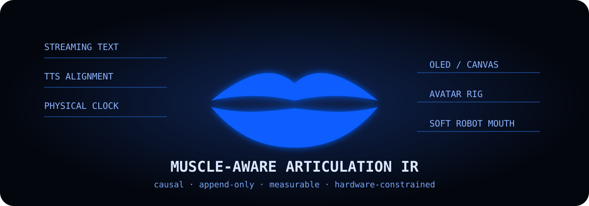

# Robot LipSync

**Real-time, muscle-aware lip sync for robots and constrained displays.**

[](https://github.com/Muurrphy/robot-lipsync/actions/workflows/ci.yml)
[](https://www.python.org/)
[](LICENSE)
[](CHANGELOG.md)



Robot LipSync converts **growing TTS alignment** into continuous, expressive mouth motion while audio is still being generated. The same append-only timeline can drive an OLED, a browser canvas, an avatar rig, or a low-DOF soft robot mouth.

It is one project with one promise:

> Start audible speech and readable mouth motion together, as early as possible, without reducing a mouth to a volume meter.

[中文说明](README.zh-CN.md)

## Five-minute demo — no API key or hardware

```bash
git clone https://github.com/Muurrphy/robot-lipsync.git
cd robot-lipsync
python3 -m venv .venv
source .venv/bin/activate
pip install -e .
robot-lipsync demo
```

Open `build/demo.html`. The command also writes the exact device-independent timeline to `build/demo.timeline.json`.

The built-in demo uses synthetic character timing only to make CI and first use deterministic. Real integrations should consume TTS alignment, forced alignment, or another timestamp provider.

## What is different here?

### 1. Mouth motion is articulation, not loudness

The intermediate representation exposes jaw opening, lip separation, width, rounding, pressure, protrusion, lower-lip tuck, and asymmetry. A quiet `/m/` still closes; a loud `/u/` still rounds.

### 2. It is causal and append-only

`IncrementalArticulationCompiler` accepts partial alignment, withholds unstable word suffixes, keeps one event of coarticulation look-ahead, and never rewrites motion already sent to hardware.

### 3. Muscle constraints survive low-DOF rendering

Extreme width and extreme vertical opening cannot occur simultaneously. Bilabial closure, labiodental contact, rounding, diphthong paths, and minimum readable dwell receive explicit protection.

### 4. Latency ends at the physical device

The trace schema covers end-of-user-speech, turn commitment, LLM first token, phrase commitment, TTS request/headers/first audio, first device chunk, **physical audio start**, and first visible motion. Underruns and transport gaps are quality failures, not hidden implementation details.

### 5. A near-two-second response is a measured target, not a universal claim

On the original Lilyput reference stack, most observed turns began physical playback in roughly **1.9–2.7 seconds**, with a recorded **4.573-second long tail**. Provider load, network geography, turn detection, model TTFT, phrase boundaries, TTS, and device buffering all move this number. This repository exists to make those stages visible and reproducible—not to promise every system will answer within two seconds.

## Pipeline

```text
streaming LLM text
       │
       ├─ safe first-phrase release
       ▼
TTS audio + same-stream character timestamps
       │
       ├──────────────► physical audio clock
       ▼
timed phonemes
       ▼
muscle-aware Articulation IR
       ▼
constraint + readability budget
       │
       ├─ HTML / Canvas
       ├─ OLED / LED matrix
       ├─ avatar blendshapes
       └─ serial / soft robot mouth
```

The lip-sync path does **not** require a second LLM call or upload generated audio to another model.

## Minimal API

```python
from robot_lipsync import (
    IncrementalArticulationCompiler,
    AlignmentSpan,
)

compiler = IncrementalArticulationCompiler("turn-42")

events = compiler.append([
    AlignmentSpan("H", 0, 55, "en"),
    AlignmentSpan("i", 55, 90, "en"),
    AlignmentSpan(" ", 145, 25, "en"),
])

events += compiler.finish()
for event in events:
    print(event.to_dict())
```

## CLI

```bash
# Generate the dependency-free browser preview
robot-lipsync demo --text "Good evening. How charming."

# Compile a fixed alignment fixture to versioned Articulation IR
robot-lipsync compile examples/good_evening.alignment.json \
  --output build/timeline.json

# Summarize physical response latency from JSONL traces
robot-lipsync report examples/reference_traces.jsonl \
  --mark physical_audio_start
```

## Optional ElevenLabs same-stream example

The provider adapter consumes audio and character timestamps from the **same HTTP response**. It does not send generated audio to another alignment model.

```bash
pip install -e ".[elevenlabs]"
export ELEVENLABS_API_KEY="..."
export ELEVENLABS_VOICE_ID="..."
python examples/elevenlabs_http.py "Good evening. How charming."
```

It writes raw 24 kHz signed-16-bit mono PCM, versioned Articulation IR, and a browser preview under `build/`. Credentials are read only from the environment. See the official [ElevenLabs stream-with-timestamps reference](https://elevenlabs.io/docs/api-reference/text-to-speech/stream-with-timestamps).

## Existing systems and project boundary

| System | Best at | Robot LipSync focuses on |
| --- | --- | --- |
| [Rhubarb Lip Sync](https://github.com/DanielSWolf/rhubarb-lip-sync) | Offline audio files to 6–9 cartoon mouth cues | Causal streaming, continuous articulation, physical clocks |
| [NVIDIA Audio2Face](https://github.com/NVIDIA/Audio2Face-3D-SDK) | GPU-accelerated high-dimensional digital faces | Low-resource, inspectable, hardware-constrained motion |
| [JALI](https://www.dgp.toronto.edu/~karan/jali/) | Production expressive facial animation | Open IR, small devices, robot retargeting and benchmarks |
| [Columbia Robot Lip Sync](https://www.creativemachineslab.com/lipsync.html) | Learned motion on a dedicated 10-DoF silicone face | Reproducible low-DOF budgets, accessible hardware, LeRobot path |
| [LiveKit Agents](https://github.com/livekit/agents) / [Pipecat](https://github.com/pipecat-ai/pipecat) | Full voice-agent orchestration | An articulation layer and physical audio-motion measurement that can plug into them |

We do not claim to have invented visemes, coarticulation, real-time voice agents, or learned robot lips. See [Third-party systems and research boundary](docs/third-party.md).

## Repository map

```text
src/robot_lipsync/       versioned core, providers, renderers, serial backend
schemas/                 Articulation IR and latency-trace JSON Schemas
examples/                no-key fixtures and reference traces
docs/                    architecture, biomechanics, latency, research boundary
tests/                   deterministic tests with no paid calls
```

## Benchmark rules

Do not publish the fastest single turn. A valid report includes:

- cold and warm connection runs;
- fixed prompts and at least 100 turns for serious claims;
- P50/P95/P99, not only the mean;
- end-of-turn, LLM, phrase, TTS, host, transport, and physical-device stages;
- underruns, maximum feed gap, cut-off rate, and prosody failures;
- provider, model, voice type, region, hardware, and buffer configuration.

See [Physical latency benchmark](docs/latency-benchmark.md).

## Status

`v0.1.0` is an alpha extraction from a working dual-ESP32 robot prototype. The core, offline demo, schemas, tests, and optional ElevenLabs timestamp adapter are present. The generic OLED firmware, Pipecat/LiveKit adapters, 1/3/4/6-DoF benchmark suite, and LeRobot silicone-mouth plugin remain roadmap work.

See [Roadmap and release gates](docs/roadmap.md). Issues and evidence-backed pull requests are welcome.

## License

MIT. External papers, models, datasets, and products linked by the documentation retain their own licenses; none of their code or weights is redistributed here.
